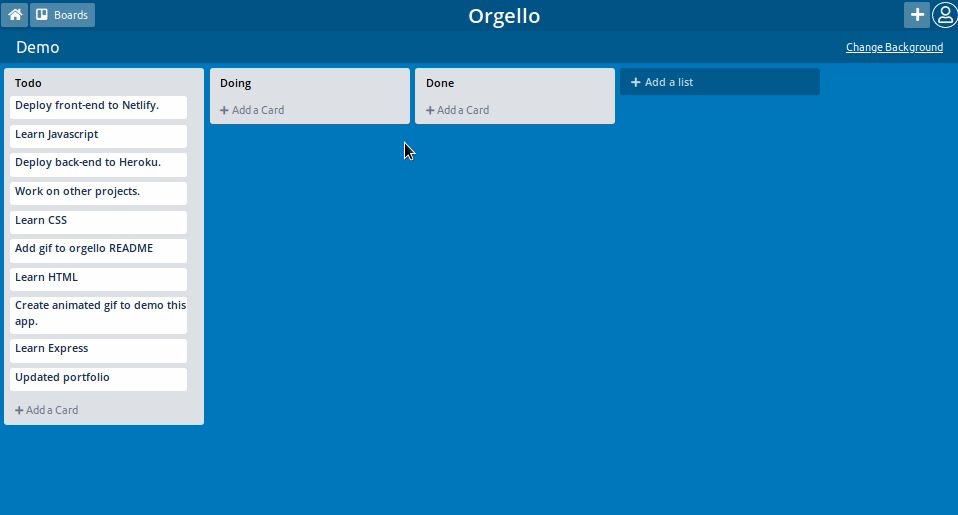

# Orgello

> React/Redux on the client and Node/Express/PostgreSQL API on the server.

## Features

- Create boards, lists, and cards
- Drag and Drop functionality
- Board background images using Unsplash API
- Implemented Authentication and Authorization using JWT
- Data saved to a PostgreSQL database via Express API.
- Deployed to Heroku(server) and Netlify(client)

## Demo



**Prerequisites**

- [Node](https://nodejs.org)
- [PostgreSQL](https://www.postgresql.org/)
- [Unsplash](https://unsplash.com/developers) account
- [Git](https://git-scm.com/)

## Install Locally

1. clone this repo with

   `git clone git@github.com:ben-garcia/orgello.git`

2. `cd` into `/client` and `/server` and install dependencies with

   `npm install` or `yarn`

3. rename `.env.sample` to `.env` in `/server` and add the appropriate variables

```
DB_USERNAME=your_db_username
DB_PASSWORD=your_db_password
DB_NAME=your_db_name
DB_HOST=your_db_host
DB_DIALECT=your_db_dialect

JWT_SECRET=your_jwt_secret

UNSPLASH_APPLICATION_ID=your_unsplash_application_id
UNSPLASH_SECRET=your_unsplash_secret
```

4. start the server

   `npm run start`

   or

   `yarn start`

   which will start the server on port 9000.

5. start the client

   `npm run start`

   or

   `yarn start`

   which will start the client on port 8080.
