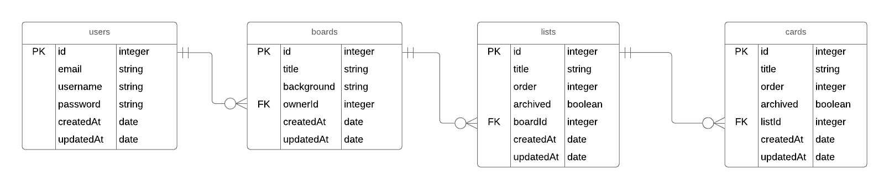

# Orgello

**Trello clone**

## The Plan

_React/Redux on the client and Express API using PostgreSQL on the server_

## TODO

_will most likely change as I work_

- Client

  - **Setup**

    - ~~install Webpack and React~~
    - ~~install ESLint with Airbnb~~
    - install React Router
    - install Redux

  - **Components**

    - create Navbar component
    - create Footer component
    - create Login component
    - create Signup component
    - create Dashboard component
    - create Board component
    - create List component
    - create Card component

  - **Router**

    - if the user isn't logged in, redirect to the 'Login'
    - when the user clicks 'Login' it should load the 'Login' component.
      - when the user is logged in they should be redirected to their 'Dashboard'
    - when the user clicks 'Signup' it should load the 'Signup' component.
      - after the user signs up they should be redirected to their 'Dashboard'

  - **Redux**
    - async actions using redux-thunk or redux-saga
    - isUserLoggedIn - boolean
    - users boards
    - users lists
    - users cards

- Server

  - **Setup**

    - ~~install up express~~
    - ~~install volleyball for logging~~
    - ~~install cors( not sure if I'll need it as I plan to deploy to the same server)~~
    - ~~install sequelize/pg pg-hstore to communicate with PostgreSQL~~
    - ~~install ESLint with Airbnb~~
    - ~~install joi for validate with out db models~~
    - ~~install bcrypt to hash password before inserting in db.~~
    - ~~install jsonwebtoken for authentication/authorization~~

  - **Models**

    > sequelize adds id(primary key), createdAt, and updatedAt fields

    - ~~_users_~~

      - ~~attributes: email(string), username(string), password(string)~~
        - ~~unique contraints on email and username~~
        - ~~all are required~~
      - ~~hasMany boards~~

    - ~~_boards_~~

      - ~~attributes: title(string), background(string), ownerId(integer)~~
        - ~~title and ownerId are required~~
        - ~~background default value is '#ffffff'~~
      - ~~hasMany lists~~
      - ~~belongsTo user~~

    - ~~_lists_~~

      - ~~attributes: title(string), order(integer), archived(boolean), boardId(integer)~~
        - ~~title, order and boardId are required~~
        - ~~order has unique contraint~~
        - ~~archived default value is 'false'~~
      - ~~hasMany cards~~
      - ~~belongsTo board~~

    - ~~_cards_~~
      - ~~attributes: title, order, archived, listId~~
        - ~~title, order, listId are required~~
        - ~~order has unique contraint~~
        - ~~archived default value is 'false'~~
      - ~~belongsTo list~~

  - **Routers**

    - _/users_

      - GET

        - /:id
          - get a single user
          - protected route. user needs authorization

      - ~~POST~~

        - ~~create a user and add it to the db~~
        - ~~hash password before storing in db~~

      - DELETE
        - /:id
          - remove the user with the id from the db

    - _/boards_

      - POST

        - create a board associated with a user

      - PUT
        - /:id
          - modify the board

    - _/lists_

      - ~~POST~~
        - ~~create a list associated with a board~~
      - PUT
        - /:id
          - modify a board with :id in the db
      - DELETE

        - /:id
          - archive to list with the :id

    - _/cards_

      - ~~POST~~
        - ~~create a card associatad with a list~~
      - PUT
        - /:id
          - modify the list with :id
      - DELETE
        - /:id
          - archive the card with :id

## Entity-Relationship Diagram

